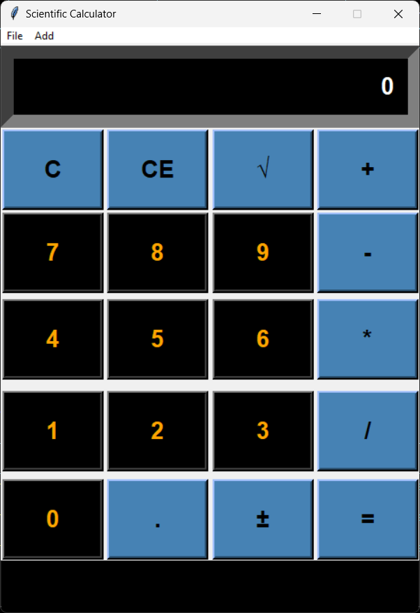
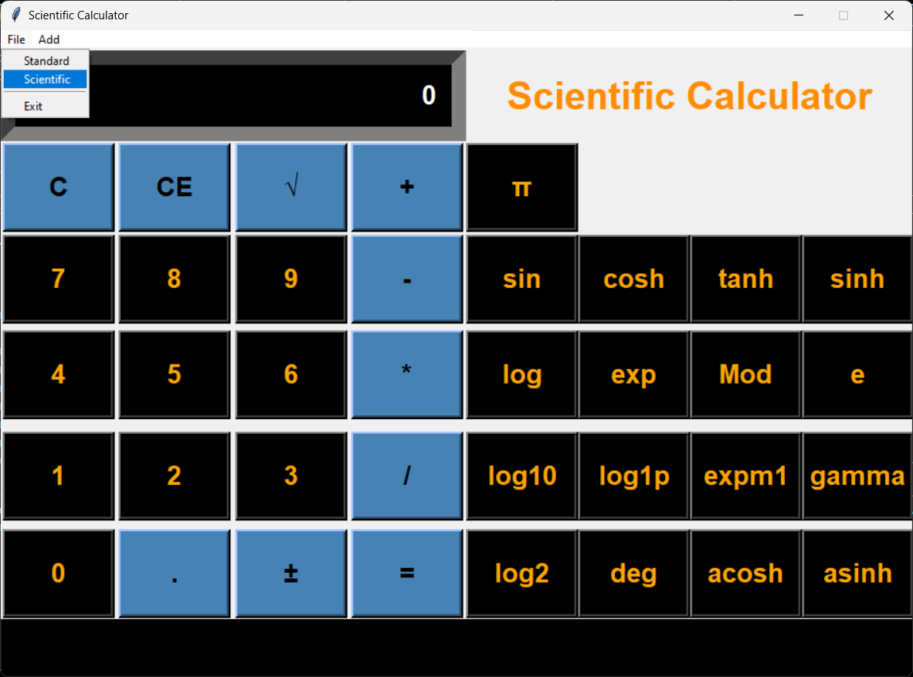

# Scientific Calculator Application

This is a **Scientific Calculator Application** built using Python's **Tkinter** library for the Graphical User Interface (GUI). The application allows users to perform simple and complex calculations / arithmetic operations.

## Features
- Simple and user-friendly GUI.
- Supports basic & complex arithmetic operations

## Installation

To run the Calculator Application, ensure you have Python installed on your system. Follow the steps below to set up the project.

### Clone the Repository
```bash
git clone https://github.com/PranitaKute/Python-GUI/tree/main/Scientific-Calculator.git
cd Scientific-Calculator
```

### Create a Virtual Environment (Optional but Recommended)
```bash
python -m venv venv
source venv/bin/activate   # For Linux/Mac
venv\Scripts\activate     # For Windows
```

### Install the Required Packages
Run the following command to install all the dependencies.
```bash
pip install -r requirements.txt
```

## How to Run the Application
Once the dependencies are installed, run the following command to start the application:
```bash
python calculator.py
```

## Project Structure
```
Scientific-Calculator/
├── calculator.py         # Main application file
├── requirements.txt      # List of dependencies
└── README.md             # Project documentation
```

## Requirements
The following Python packages are required to run the application:

- `tkinter`

You can also check the `requirements.txt` file for the list of dependencies.

## Usage
- Launch the application by running `python calculator.py`.
- Enter numbers and select the arithmetic operation you want to perform.
- The result will be displayed on the screen.

## Screenshots

### Main Interface


### Scientific Calculator Interface


## Contributing
Contributions are welcome! Feel free to fork the repository and submit a pull request.

## Author
**Pranita Kute**

---


